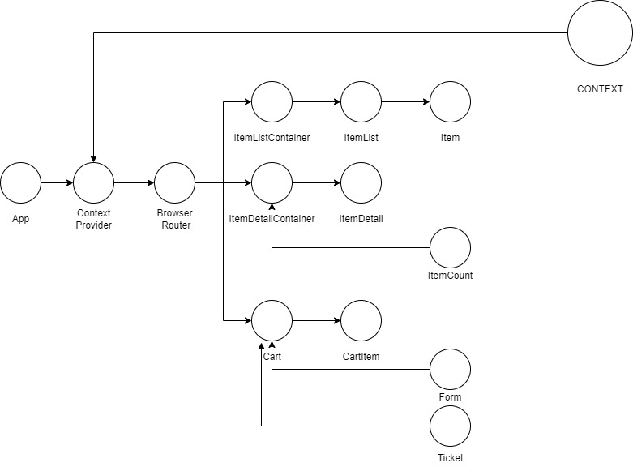

# Documentación del proyecto - Buy IT E-Commerce

Antes que nada, podés ver y probar la aplicación en este [link](https://quizzical-leavitt-dd6ac2.netlify.app/)
Ahora sí, a la documentación... ;)

## Descripción
Esta aplicación consiste en una plataforma de e-commerce que, utilizando llamadas a una API, trae información de productos y los muestra para que el usuario pueda "comprarlos", navegando por categorías y visualizando el detalle de cada uno de los productos. 

Las categorías para filtrar productos siguen la estructura de la API de Fakestore ("Electronics", "Jewelery"), la cual fue utilizada para desarrollar la aplicación. Más tarde, los productos almacenados allí fueron importados a una base de datos del servicio de Firebase (Firestore).

## Tecnologías utilizadas
* [styled-components](https://styled-components.com/) (^5.3.3): Styled Components es una  librería desarrollada para React y React Native. Permite darle estilos a los componentes en un formato "css in js", es decir, escribiendo código CSS directamente en archivos de extensión .js. La decisión de incluir esta librería se fundamenta en la posibilidad de tener separadas las responsabilidades de arquitectura, lógica y estilos de cada componente en archivos separados, todos ellos dentro de su carpeta correspondiente. 

* [react-hot-toast](https://react-hot-toast.com/) (^2.1.1): React Hot Toast es una librería que permite generar y mostrar notficaciones en pantalla de una forma altamente customizable, simple y eficiente.

* [formik](https://formik.org/) (^2.2.9): Librería para formularios desarrollada con el objetivo de reducir la verbosidad necesaria para controlar y manejar la obtención y envío de información a través de los formularios en React. Provee componentes, hooks y funciones altamente declarativas que, en pocas líneas de código, permiten controlar, validar y utilizar información que los usuarios brindan a través de formularios, manejando los estados de los componentes sin necesidad de funciones flecha ni event listeners. 

En este caso, Formik se utiliza para simular un formulario de pago, aunque solamente se piden nombre completo y dirección de correo. Estos datos se almacenan en la colección "ventas" de la base de datos con el ID de compra.

* [Firebase](https://firebase.google.com/) (^9.6.2): Software de desarrollo de Google, el cual provee diversos servicios, entre ellos Firestore. Este último servicio se implementó en el proyecto por la rapidez y facilidad con la que te permite disponer de una base de datos donde almacenar la información. Firestore brinda funciones para realizar todas las operaciones CRUD necesarias (create, read, update, delete).

Puntualmente, el flujo de la información en la aplicación consiste en llamadas a la BD para traer los productos, ya sea todos juntos o filtrados por id/categorías (read), y en la creación de documentos que registran las compras de los usuarios en la colección 'Ventas' (create).

Para más información sobre Firestore y los otros servicios de Firebase, ver la [documentación de Firebase](https://firebase.google.com/docs/)


## estructura de los componentes
Se implementó una estructura de responsabilidad única de los componentes. El flujo es mayormente tripartito, salvo en algunas excepciones en las que dos componentes son suficientes para performar eficientemente el flujo de la información sin comprometer este principio de organización. De esta forma, la estructura de los componentes queda organizada en:

Componente1 => Componente2 => Componente3

En este ejemplo, Componente1 es el encargado de realizar las consultas a la API y recibir la información. Componente2 la recibe como props y se encarga de ordenarla (Por ejemplo, en el caso de recibir una lista de productos, se encarga de realizar el mapeo de los mismos para luego pasárselos al Componente3). Componente3, finalmente, se encarga de estructurar la información para pintarla en el navegador.

(Nota: En el ejemplo se mencionan tres componentes, pero cabe insistir en que el número de componentes está supeditado a la cantidad de operaciones/responsabilidades requeridas por el flujo de información).




## ¿Cómo lo pruebo?
1. Clona el repositorio
```
git clone http://https://github.com/FrancoPaganucci/e-commerce-paganucci.git
```
2. Ubicarse en la carpeta correspondiente desde la consola (Git Bash)
```
cd proyecto
```
3. Ejecutar el instalador de todas las dependencias necesarias para correr la aplicación
```
npm install
```
4. Una vez instaladas todas las dependencias, ejecutar el script de inicialización de la aplicación
```
npm start
```
5. Para terminar el proceso, ejecutar el siguiente comando en consola (AltGr+C en Windows):
```
^C
```
(en Mac OS):
```
killall + <nombre-de-la-app>
```

## Pendientes: Modificaciones por hacer.

Estos son algunos features/oportunidades de refactorización para continuar mejorando la aplicación que, al momento de la entrega del proyecto, quedan pendientes:

* Versión Responsive (Tablet, Mobile)
* Sistema de Auth-Login
* Persistencia de carrito
* Completar el navbar para mostrar todas las categorías disponibles en la API, hidratando automáticamente el menú desde la misma.
* Adaptar el formulario para que se acerce más a una simulación de pago (Se podría incluir métodos de envío, tarifas diferenciales, etc...)

## Información personal

¡Hola! Mi nombre es Franco y soy un desarrollador web viviendo en Buenos Aires, Argentina (CABA). 

Si te gustó el proyecto, o si tenés algún comentario, sugerencias, críticas, lo que sea, no dudes en contactarme. ¡El feedback siempre es más que bienvenido! :)

Contacto:
[LinkedIn](https://www.linkedin.com/in/francoepaganucci/)
[GitHub](https://github.com/FrancoPaganucci)

Otros Proyectos:
[GIFOS](https://github.com/FrancoPaganucci/GIFOS) - Aplicación web interactiva para compartir GIFs animados. La podés ver live [acá](https://francopaganucci.github.io/GIFOS/)
[Delilah-Resto](https://github.com/FrancoPaganucci/delilah-resto) - Sistema backend de pedidos online para un restaurante. (API CRUD)

¡Gracias por llegar hasta acá!

Franco Paganucci - Web Developer